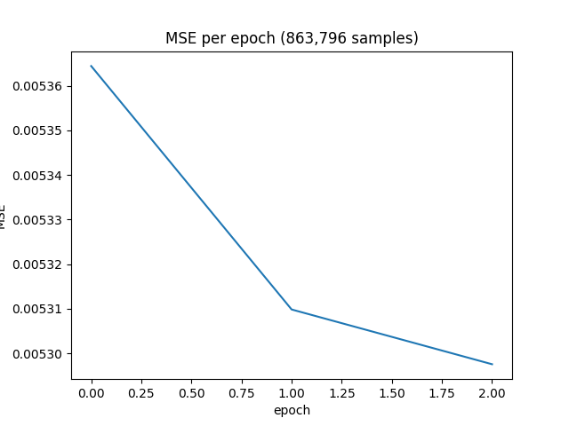

# March 13, 2025
* Conducted experiments on 2400 games of Kasparov on a Simple Feed Forward NN, Feed Forward NN with Attention and an RNN
* Feed Forward with attention performed the best
* Will be collecting more data next on Magnus Carlsen and Bobby Fischer

# March 15, 2025
* Finished Training my first model on 1300 epochs on 860,000 samples.
* The MSE flattened at 0.0053

  
* Final model is a Feed Forward NN with an attention layer (64 heads)
* Training for this model took around 21 hours on my CPU

# March 17, 2025
* Had my first test with the chess agent playing itself. The game started out well with the agent opening professionally. However, as the game developed the moves started to make less and less sense
* Started another training loop with a slightly modified dataset that repeats some states more than others in an attempt to fill the gaps in scarcity

# March 18, 2025
* After good trial and error testing with neural networks and creating first agent, I am restarting.

# March 19, 2025
* Pivoted to second Agent
* Planning on having a tree search function to check future board states
* Planning on having a neural network that will evaluate the probability of winning on a particular board

# March 20, 2025
* Experimented on different CNN architectures for evaluation model
* Figured out that my model is very good at memorizing a dataset, probably need to train on more samples
* Curated my first list object of unique board states

# March 22, 2025
* Training my CNN on a curated dataset of around 23 million unique samples
* Fixed DRAM memory issue by compressing list keys to binary objects and values in the dictionary to strings
  * With so many samples, my 32 GB ram was getting full and the system starting using my SSD which was slower
* Split the samples into pikl files containing 1,500,000 samples each (after randomizing the order)
* Updated training/testing code to handle reading and training across multiple files

# May 17, 2025
* Finally finished all school work for the semester and heading to internship rn
* Going to pivot because results have been under satisfactory

